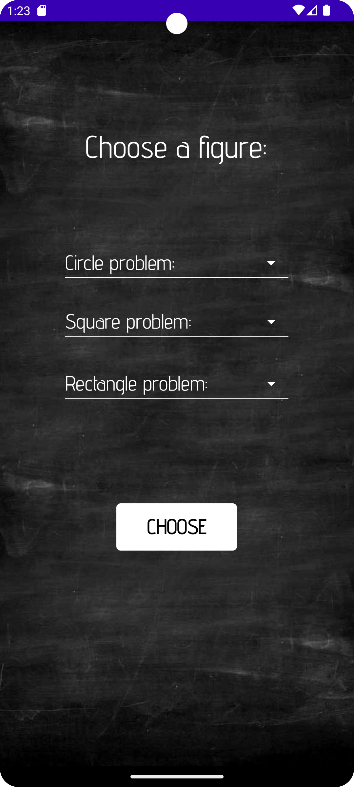

# LearnPlaneGeometry 📚

<b>LearnPlaneGeometry</b> is an application intended for 7th grade students and beyond, with the aim of helping them learn some aspects of plane geometry.
 

In making this application, I used the Android Studio IDE. The programming language used is Java, and for the backend part I used SQLite database.

<h2>App structure:</h2>
<ul>
  <li><b>Landing Screen</b></li>
    
     
</ul>
<ul>
  <li><b>Authentification Screens</b></li>

For the authentification part I used SQLite. Here the user can log in or register for access to the entire application.

   
   
   
</ul>
<ul>
  <li><b>Choose Figure Screen</b></li>

In this screen, the user has the option to choose one of the 3 geometric figures displayed on the screen, and after choosing it, he will be able to choose the type of problem he wants to solve.

   
   
   
</ul>
<ul>
  <li><b>Dimension Screen</b></li>

After choosing the problem, the user will enter the data of the problem.

   
   
</ul>
<ul>
  <li><b>Solving Screen</b></li>

In this screen is the solution to the problem. After entering the desired dimensions to solve the problem, the application will solve and display the answer to the problem selected earlier, along with the specific formula.

Also, when changing the seekBar below, the user can change the problem data with a value between 100 and 700, which will be changed later in the formula above. Also with the help of this seekBar, when moving it, the size of the geometric figure will also change, which can take values ​​between 100 and 700.

   
   
   
</ul>
